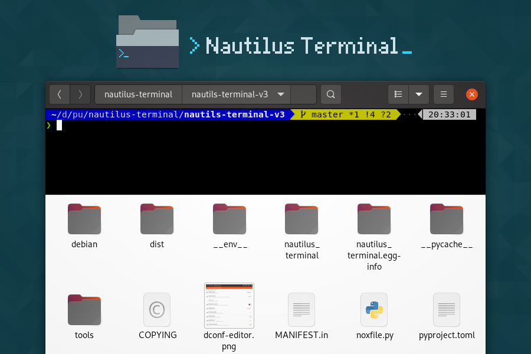

# Nautilus Terminal 3

> A terminal embedded in Nautilus, the GNOME's file browser

**Nautilus Terminal** is a terminal embedded into Nautilus, the GNOME's file
browser. It is always opened in the current folder, and follows the navigation
(the `cd` command is automatically executed when you navigate to an other
folder).

**NOTE:** This is a complete re-implementation of [my previous Nautilus
Temrinal plugin][old-nterm].

**NOTE²:** This is an early development version, some feature are missing (see
below).

**Features:**

* Embed a Terminal in each Nautilus tab / window,
* Follow the navigation: if you navigate in Nautilus, the `cd` command is
  automatically executed in the terminal,
* Detects running process: if something is running in the terminal, the `cd`
  command is not send to the shell,
* Automatically respawn the shell if it exits,
* Supports copy / paste from / to the terminal using
  `Ctrl+Shift+C` / `Ctrl+Shift+V`,
* Can be displayed / hidden using the `F4` key,
* Supports drag & drop of file on the terminal,
* Uses the default shell for the user.
* ~~Allows to configure the terminal appearance (colors, font,...).~~ **TODO**

**Requirements:**

* [nautilus-python][]
* [psutil][]

## Installing Nautilus Terminal

### From PYPI

User install:

    pip install nautilus_terminal

System-wide install:

    sudo pip install nautilus_terminal
    sudo tools/update-extension-system.sh install   # foreseeable future

Then kill Nautilus to allow it to load the new extension:

    nautilus -q

### From sources

Clone the repositiory:

    git clone git@github.com:flozz/nautilus-terminal.git
    cd nautilus-terminal

To install into your personal Python lib and your personal Nautilus python
extension folders, run the following from your normal unprivileged account. Pip
will select the `--user` scheme.

    pip install .

To install for all users, run the command as root instead. Pip will select the
`--system` scheme if you install this way. This drops everything into
`/usr/local` instead, but nautilus-python doesn't look there for extensions
(see upstream [bug 781232][]). So for the foreseeable future, system-wide
installs need an extra step to make the extension available for all users.

    sudo pip install .
    sudo tools/update-extension-system.sh install

Then kill Nautilus to allow it to load the new extension:

    nautilus -q

## Uninstalling

To uninstall the package, run:

    pip uninstall nautilus-terminal

If you installed it for all users:

    sudo pip uninstall nautilus-terminal
    sudo tools/update-extension-system.sh uninstall   # foreseeable future

## Configuring

Nautilus Terminal can be configured, but there is no GUI to configure it yet.
Currently, configuration can be done through the **DConf Editor** tool:

* Run DConf Editor: `dconf-editor`,
* Navigate to `/org/flozz/nautilus-terminal`
* Configure Nautilus Terminal.

## Hacking and Debug

If you want work on this software, you will first have to install the
[nautilus-python][] and [psutil][] packages. On Debian / Ubuntu, you will find
it in the `python-nautilus` and `python-psutil` packages:

    sudo apt install python-nautilus python-psutil

This extension comes in two parts: a conventional Python module
(`nautilus_terminal`), and a small bit of bootstrap code that's loaded by
`python-nautilus` when Nautilus starts up (`nautilus_terminal_extension.py`).
The bootstrap code must be installed where `python-nautilus` can find it before
you can start making changes and testing them:

    tools/update-extension-user.sh install         # Current user only…
    sudo tools/update-extension-system.sh install  # … or, system-wide.

When the bootstrap is loaded into Nautilus, it imports the Python module from
either the normal `PYTHONPATH`, or from your working copy of this repository if
the right debug environment is set.

With the bootstrap installed, you can use the following script to test new code
in Nautilus without having to reinstall the module:

    tools/debug-in-nautilus.sh
    tools/debug-in-nautilus.sh --no-bg  # keep Nautilus attached to the console

Happy hacking! :)

## Release

Things to do before releasing a new version:

* Update version number in `nautilus_terminal/__init__.py`
* Generate `README.rst` (requires pandoc): `tools/readme-to-rst.sh`
* Compile GSetting schema: `glib-compile-schemas nautilus_terminal/schemas`

## Changelog

* **3.2.0**: Add settings to Nautilus Terminal (#3)

* **3.1.1:**
    * Allow user install instead of system wild (#1)
    * Use the user's default shell instead of the hardcoded zsh (#2)
    * Focus the terminal after drag & drop of file on it (#4)
* **3.1.0:**
    * File drag & drop support
    * Hide the terminal in virtual emplacements (trash,...)
    * Optimizations (do not spawn the shell / no "cd" if the shell is not
      visible)
* **3.0.1:** Script to convert the README to reStructuredText for PYPI
* **3.0.0:** Initial Nautilus Terminal 3 release (early development version)

## License GPLv3

    Nautilus Terminal - A terminal embedded in the Nautilus file browser
    Copyright (C) 2010-2017  Fabien LOISON <http://www.flozz.fr/>

    This program is free software: you can redistribute it and/or modify
    it under the terms of the GNU General Public License as published by
    the Free Software Foundation, either version 3 of the License, or
    (at your option) any later version.

    This program is distributed in the hope that it will be useful,
    but WITHOUT ANY WARRANTY; without even the implied warranty of
    MERCHANTABILITY or FITNESS FOR A PARTICULAR PURPOSE.  See the
    GNU General Public License for more details.

    You should have received a copy of the GNU General Public License
    along with this program.  If not, see <http://www.gnu.org/licenses/>.

[old-nterm]: https://launchpad.net/nautilus-terminal
[nautilus-python]: https://wiki.gnome.org/Projects/NautilusPython/
[psutil]: https://pypi.python.org/pypi/psutil/
[bug 781232]: https://bugzilla.gnome.org/show_bug.cgi?id=781232
