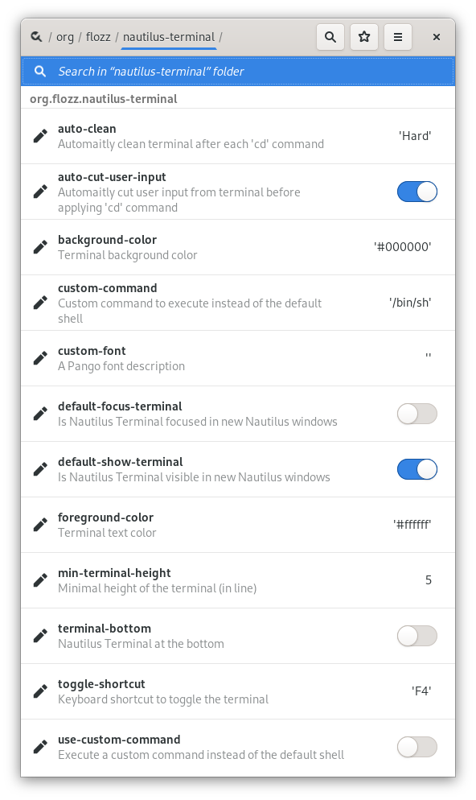

END OF LIFE NOTICE
==================

After 12 years of existence, it seems that it is the end of Nautilus Terminal.

Since its version 43, Nautilus was ported to GTK 4. Its plugin APIs has changed, and the API Nautilus Terminal relied on has disappeared, so it is not possible to port it:

    **LocationWidgetProvider**

    The Nautilus.LocationWidgetProvider was removed without replacement. If your script requires it, you can request a new model-based API for your specific use case on the `Nautilus issue tracker <https://gitlab.gnome.org/GNOME/nautilus>`_.

Nautilus Terminal was never a "first class citizen" in Nautilus: it hijacked existing APIs to slip into Nautilus. It used a lot of hacks to work around limitations and to work (you can read the comments in `nautilus_terminal.py <https://github.com/flozz/nautilus-terminal/blob/master/nautilus_terminal/nautilus_terminal.py>`_ if you're curious).

I already wrote a quite long `blog post about Nautilus Terminal <https://blog.flozz.fr/2018/12/17/nautilus-terminal-lhistoire-dun-projet-complique/>`_ years ago where I stated that its future was unsure.

There may be some APIs in the future to integrate a terminal in Nautilus (and if that happens, everything will have to be redeveloped from scratch), but I think that for now, it is the end of the project.

A big thanks to all users and contributors of Nautilus Terminal.

Original message: https://github.com/flozz/nautilus-terminal/issues/82#issuecomment-1291969366

----

Nautilus Terminal 3
===================

|Lint / Tests| |PYPI Version| |License| |Discord| |Black|

   A terminal embedded in Nautilus, the GNOME’s file browser

**Nautilus Terminal** is a terminal embedded into Nautilus, the GNOME’s
file browser. It is always opened in the current folder, and follows the
navigation (the ``cd`` command is automatically executed when you
navigate to another folder).

**NOTE:** This is a complete re-implementation of `my previous Nautilus
Terminal plugin <https://launchpad.net/nautilus-terminal>`__.

.. figure:: https://raw.githubusercontent.com/flozz/nautilus-terminal/master/screenshot.png
   :alt: Nautilus Terminal Screenshot

Main Features
-------------

* Embed a Terminal in each Nautilus tab / window,
* Follows the navigation: if you navigate in Nautilus, the ``cd``
  command is automatically executed in the terminal,
* Can be displayed / hidden using the ``F4`` key (configurable),
* Configurable: font, background and text color, terminal position (displayed
  at top or at bottom of the windows),...
* Supports copy / paste through contextual menu and
  ``Ctrl+Shift+C`` / ``Ctrl+Shift+V``,
* Supports drag & drop of file on the terminal,
* ...

If you want to read more about this project and its history, I wrote an
article on my blog (it is in French, but Google Translate should help) :
`Nautilus Terminal: The story of a complicated
project <https://blog.flozz.fr/2018/12/17/nautilus-terminal-lhistoire-dun-projet-complique/>`__.

Installing Nautilus Terminal
----------------------------

Requirements
~~~~~~~~~~~~

* A recent version of **Nautilus 3.x** or **Nautilus 40**,
* `nautilus-python <https://wiki.gnome.org/Projects/NautilusPython/>`__,
* `psutil <https://pypi.python.org/pypi/psutil/>`__,
* GLib 2 tools (``glib-compile-schemas``),
* dconf-editor (to configure the application; this will no more be required in
  the future).

ArchLinux
~~~~~~~~~

Nautilus Terminal is available in the ArchLinux's *Community* repository. To
install it, run the following command::

    sudo pacman -S nautilus-terminal

Then close current Nautilus instance to apply the changes::

    nautilus -q

Package source: https://archlinux.org/packages/community/any/nautilus-terminal/

Fedora (TomaszGasior's Package)
~~~~~~~~~~~~~~~~~~~~~~~~~~~~~~~

To install Nautilus Terminal on Fedora using the TomaszGasior's package, run
the following commands::

   dnf copr enable tomaszgasior/mushrooms
   dnf install nautilus-terminal

Then close current Nautilus instance to apply the changes::

    nautilus -q

Package source: https://github.com/TomaszGasior/mushrooms-rpms/tree/nautilus-terminal

Ubuntu
~~~~~~

There is no specific package for Ubuntu yet, so you will have to install it
from PyPI.

Ubuntu 20.04 and later
^^^^^^^^^^^^^^^^^^^^^^

To install Nautilus Terminal on Ubuntu >= 20.04, first install dependencies::

   sudo apt install python3-nautilus python3-psutil python3-pip libglib2.0-bin dconf-editor

Then install Nautilus Terminal::

    sudo pip3 install nautilus-terminal
    sudo nautilus-terminal --install-system

Finally close current Nautilus instance to apply the changes::

    nautilus -q

Ubuntu 19.10 and earlier
^^^^^^^^^^^^^^^^^^^^^^^^

To install Nautilus Terminal on Ubuntu <= 19.10, first install dependencies::

   sudo apt install python-nautilus python-psutil python-pip libglib2.0-bin dconf-editor

Then install Nautilus Terminal::

    sudo pip install nautilus-terminal
    sudo nautilus-terminal --install-system

Finally close current Nautilus instance to apply the changes::

    nautilus -q

From PyPI
~~~~~~~~~

You can install Nautilus Terminal system-wide or for the current user. The
system-wide install is recommended.

System-wide install (recommended)::

   sudo pip3 install nautilus_terminal
   sudo nautilus-terminal --install-system

User install::

   pip3 install --user nautilus_terminal
   python3 -m nautilus_terminal --install-user

Then close current Nautilus instance to apply the changes::

   nautilus -q

From sources
~~~~~~~~~~~~

Clone the repository and navigate to it::

   git clone https://github.com/flozz/nautilus-terminal.git
   cd nautilus-terminal

You can install Nautilus Terminal system-wide or for the current user. The
system-wide install is recommended.

System-wide install (recommended)::

   sudo pip3 install .
   sudo nautilus-terminal --install-system

User install::

   pip3 install --user .
   python3 -m nautilus_terminal --install-user

Then close current Nautilus instance to apply the changes::

   nautilus -q

Updating (PyPI package)
-----------------------

If you made a system-wide install (recommended)::

   sudo pip3 install --upgrade nautilus_terminal
   sudo nautilus-terminal --install-system

If you made an user install::

   pip3 install --user --upgrade nautilus_terminal
   python3 -m nautilus_terminal --install-user

Uninstalling (sources or PyPI package)
--------------------------------------

System-wide uninstall::

   sudo nautilus-terminal --uninstall-system
   sudo pip3 uninstall nautilus-terminal

User uninstall::

   python3 -m nautilus_terminal --uninstall-user
   pip3 uninstall nautilus-terminal

Configuring
-----------

Nautilus Terminal can be configured, but there is no GUI to configure it
yet. Currently, configuration can be done through the **DConf Editor**
tool::

    dconf-editor /org/flozz/nautilus-terminal

Trouble Shooting
----------------

Nautilus Terminal Doesn't show up
~~~~~~~~~~~~~~~~~~~~~~~~~~~~~~~~~

Nautilus Terminal Doesn't show up? Here are a bunch of things to check before
opening an issue:

* Try to restart Nautilus::

        nautilus -q

* Try to restart Nautilus and keep it attached to a terminal to catch eventual
  error messages::

        nautilus -q && nautilus

* Check that the extension is properly installed with one of the following
  commands::

        nautilus-terminal --check
        python3 -m nautilus_terminal --check

  If everything is OK, the output should be::

        Nautilus Python: Installed
        Nautilus Terminal Extension: Installed

  If there is any error, you will have an help message similar to this one to
  tell you how to fix::

        Nautilus Python: Installed
        Nautilus Terminal Extension: Absent
            Please install the Nautilus Extension with one of the following commands:
            System-wide: sudo nautilus-terminal --install-system
            Current user: nautilus-terminal --install-user
            NOTE: you may need to replace the 'nautilus-terminal' command by 'python3 -m nautilus_terminal'.

* Try to get some logs from Nautilus::

        nautilus -q && nautilus

Nautilus crashes at startup
~~~~~~~~~~~~~~~~~~~~~~~~~~~

If Nautilus crashes at startup, the first thing to do is to get some logs. Run
it from a terminal with the following command and check if there is something
useful in the logs::

    nautilus -q ; nautilus

If you see an error similar to this one::

    (org.gnome.Nautilus:9812): GLib-GIO-ERROR **: 18:42:59.373: Settings schema 'org.flozz.nautilus-terminal' does not contain a key named 'default-focus-terminal'

It means that an older version of the GSettings schema is installed. Search for
the following files on your system and removes them:

* ``/usr/share/glib-2.0/schemas/org.flozz.nautilus-terminal.gschema.xml``
* ``/usr/local/share/glib-2.0/schemas/org.flozz.nautilus-terminal.gschema.xml``
* ``~/.local/share/glib-2.0/schemas/org.flozz.nautilus-terminal.gschema.xml``

Once done, recompile GSettings databases with the following commands (depending
on which files you found)::

    sudo glib-compile-schemas /usr/local/share/glib-2.0/schemas
    sudo glib-compile-schemas /usr/share/glib-2.0/schemas
    glib-compile-schemas ~/.local/share/glib-2.0/schemas/

Once done, reinstall the schema with one of the following commands::

   # For system-wide install (recommended)
   sudo nautilus-terminal --install-system

   # For user install
   python3 -m nautilus_terminal --install-user

Finally restart Nautilus.

Detect if running inside nautilus-terminal
~~~~~~~~~~~~~~~~~~~~~~~~~~~~~~~~~~~~~~~~~~

To detect whether the shell is running inside nautilus-terminal, there is an
environment variable exposed when executing the shell::

   INSIDE_NAUTILUS_PYTHON=1

It is useful in case you want to avoid running things inside the
nautilus-terminal::

   ~/.bashrc:

   # Run termux only if not inside nautilus-terminal
   if [ -z "$INSIDE_NAUTILUS_PYTHON" ]; then
     tmux -attach
   fi

Reporting an issue
~~~~~~~~~~~~~~~~~~

If none of the above worked, please `open an issue
<https://github.com/flozz/nautilus-terminal/issues>`_ with as much information
as possible:

* How did you installed Nautilus Terminal,
* What you tried,
* Any error message outputted during the installation or by Nautilus,
* When possible, please include the output of one of the following command::

        nautilus-terminal --print-debug
        python3 -m nautilus_terminal --print-debug

Hacking and Debug
-----------------

If you want work on this software, you will first have to install the
dependencies listed above.

This extension comes in two parts: a conventional Python module
(``nautilus_terminal``), and a small bit of bootstrap code that’s loaded
by ``python-nautilus`` when Nautilus starts up
(``nautilus_terminal_extension.py``). The bootstrap code must be
installed where ``python-nautilus`` can find it before you can start
making changes and testing them::

   python3 -m nautilus_terminal --install-user  # Current user only
   sudo python3 -m nautilus_terminal --install-system  # System-wide

When the bootstrap is loaded into Nautilus, it imports the Python module
from either the normal ``PYTHONPATH``, or from your working copy of this
repository if the right debug environment is set.

With the bootstrap installed, you can use the following script to test
new code in Nautilus without having to reinstall the module::

   tools/debug-in-nautilus.sh
   tools/debug-in-nautilus.sh --no-bg  # keep Nautilus attached to the console

When you start working on this extension, you will have to compile the
GSettings schema (and you will have to recompile it each time you modify the
``nautilus_terminal/schemas/org.flozz.nautilus-terminal.gschema.xml`` file)::

   glib-compile-schemas nautilus_terminal/schemas/

Running lint and tests::

   pip3 install nox
   python3 -m nox -s lint
   python3 -m nox -s test

Happy hacking! :)

Packaging This Software
-----------------------

If you want to package this software for a Linux distribution, here are some
useful information for you:

* You can use the ``python3 setup.py install --root /tmp/foo/bar`` command to
  perform a system-wide-like install in the specified folder.

* You should remove the ``nautilus_terminal/not_packaged.py`` file from your
  package. Removing this file will disable options that allow user to modify
  its installation (``--install-*`` and ``--uninstall-*`` options of the
  ``nautilus-terminal`` command).

Supporting this project
-----------------------

Wanna support this project?

* `☕️ Buy me a coffee <https://www.buymeacoffee.com/flozz>`__,
* `❤️ sponsor me on Github <https://github.com/sponsors/flozz>`__,
* `💵️ or give me a tip on PayPal <https://www.paypal.me/0xflozz>`__.

Changelog
---------

* **[NEXT]** (changes on ``master`` but not released yet):

  * Nothing yet :)

* **v4.1.0:**

  * Add an option to customize the color palette (@Acervans, #81, #83)
  * Add an option to turn bold text to brighter color (@Acervans, #83)
  * Add an option to customize highlight background and text color (@Acervans, #84)

* **v4.0.5 / v4.0.6:**

  * Enforce the presence of the ``INSIDE_NAUTILUS_PYTHON`` variable to allow
    shells to detect they are running inside Nautilus Terminal (@blackdaemon,
    #77, #80).

  * v4.0.6 only fix a syntax error in the README.

* **v4.0.4:**

  * Disable terminal audible bell (#66)

* **v4.0.3:**

  * Fix a typo in the GSettings schema (#73)

* **v4.0.2:**

  * Improve packageability (#63)
  * Adds some documentation for packagers

* **v4.0.1:**

  * Install and compile GLib schema on user-install
  * Update the documentation

* **v4.0.0:**

  * Nautilus 40 support
  * New logo
  * Adds an "About" window
  * Adds a context menu to copy/paste, run dconf-editor and display the "About"
    window
  * Adds a CLI to check, install, uninstall, print debug,...
    (``nautilus-terminal -h``)
  * Fixes Nautilus Terminal stealing the focus in new Nautilus windows (@tkachen, #54)
  * Adds an option to clear the terminal after each navigation (@tkachen, #55)
  * WARNING: This will be the last version to support Python 2.7!

* **v3.5.0:**

  * Fixes minimum height when the teminal is on the bottom (@tkachen, #52)
  * Allows to configure the font (@tkachen, #10, #53)
  * Drops Python 3.6 support
  * Coding style enforced using Black

* **v3.4.2:** Fixes the PYPI package with an up to date version of the
  compiled gsettings schema
* **v3.4.1:** Updates documentation and settings screenshot.
* **v3.4.0:**

  * Allows to configure the terminal toggle shortcut (#50, #43)
  * Allows to configure terminal background and text color (#32)

* **v3.3.0:**

  * New option to have the terminal at the bottom of the window (#35)

* **v3.2.3:**

  * Fixes encoding with Python 3 (#29)

* **v3.2.2:**

  * Fixes ``VteTerminal.feed_child()`` call (#12)
  * Improves child process searching (@l-deniau, #14)

* **v3.2.1:** Add a missing dependency in setup.py
* **v3.2.0:** Add settings to Nautilus Terminal (#3)
* **v3.1.1:**

  * Allow user install instead of system-wide (#1)
  * Use the user’s default shell instead of the hardcoded zsh (#2)
  * Focus the terminal after drag & drop of file on it (#4)

* **v3.1.0:**

  * File drag & drop support
  * Hide the terminal in virtual emplacements (trash,…)
  * Optimizations (do not spawn the shell / no “cd” if the shell is
    not visible)

* **v3.0.1:** Script to convert the README to reStructuredText for PYPI
* **v3.0.0:** Initial Nautilus Terminal 3 release (early development
  version)

.. |Lint / Tests| image:: https://github.com/flozz/nautilus-terminal/workflows/Lint%20and%20Tests/badge.svg
   :target: https://github.com/flozz/nautilus-terminal/actions
.. |PYPI Version| image:: https://img.shields.io/pypi/v/nautilus_terminal.svg
   :target: https://pypi.org/project/nautilus_terminal/
.. |License| image:: https://img.shields.io/pypi/l/nautilus_terminal.svg
   :target: https://github.com/flozz/nautilus-terminal/blob/master/COPYING
.. |Discord| image:: https://img.shields.io/badge/chat-Discord-8c9eff?logo=discord&logoColor=ffffff
   :target: https://discord.gg/P77sWhuSs4
.. |Black| image:: https://img.shields.io/badge/code%20style-black-000000.svg
   :target: https://black.readthedocs.io/en/stable/
